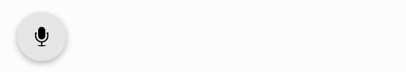

[](https://audio-recorder.streamlit.app)
# streamlit-audiorecorder

### An audio Recorder for streamlit

#### Description
Audio recorder component for streamlit.  
It creates a button to start the recording and takes three arguments: the start button text, the stop button text, and the pause button text.  
If the pause button text is not specified, the pause button is not displayed.


If all prompts are given as empty strings, the component will use the [react-audio-recorder](https://github.com/samhirtarif/react-audio-recorder) visualizer:



#### Parameters
The signature of the component is:
```python
audiorecorder(
    start_prompt="Start recording",
    stop_prompt="Stop recording",
    pause_prompt="",
    custom_style={'color': 'black'},
    start_style={},
    pause_style={},
    stop_style={},
    show_visualizer=True,
    key=None):
```
The prompt parameters are self-explanatory.  
The style parameters are dictionaries that allow you to customize the appearance of the buttons using CSS.
The `custom_style` parameter is applied to all buttons, while the `start_style`, `pause_style`, and `stop_style` parameters are applied only to the corresponding button.  
The optional `key` parameter is used internally by Streamlit to properly distinguish multiple audiorecorders on the page.  
The `show_visualizer` parameter is a boolean that determines whether to show live audio visualization while recording. If set to False, the text "recording" is displayed. It is used only when all prompts are empty strings.

#### Return value
The component's return value is a [pydub](https://github.com/jiaaro/pydub/) [`AudioSegment`](https://github.com/jiaaro/pydub/blob/master/API.markdown#audiosegment).  
All `AudioSegment` methods are available. In particular, you can:
- Play the audio in the frontend with `st.audio(audio.export().read())`
- Save the audio to a file with `audio.export("audio.wav", format="wav")`

### Installation:
```bash
pip install streamlit-audiorecorder
```
Note: This package uses ffmpeg, so it should be installed for this audiorecorder to work properly.

On Ubuntu/Debian: `sudo apt update && sudo apt install ffmpeg`  
On Mac: `brew install ffmpeg`

### Usage:
```python
import streamlit as st
from audiorecorder import audiorecorder

st.title("Audio Recorder")
audio = audiorecorder("Click to record", "Click to stop recording")

if len(audio) > 0:
    # To play audio in frontend:
    st.audio(audio.export().read())  

    # To save audio to a file, use pydub export method:
    audio.export("audio.wav", format="wav")

    # To get audio properties, use pydub AudioSegment properties:
    st.write(f"Frame rate: {audio.frame_rate}, Frame width: {audio.frame_width}, Duration: {audio.duration_seconds} seconds")
```

---
### Troubleshooting:

**Error**: No record button is shown and you get the following error message in the console:
 ```console
 Component Error
 Cannot read properties of undefined (reading 'getUserMedia')
 ```
**Reason**: To record the audio, this component uses the `MediaDevices` interface.  
For security reasons, the `getUserMedia()` method is available only in secure contexts (HTTPS), as explained in the
[MDM documentation](https://developer.mozilla.org/en-US/docs/Web/API/MediaDevices/getUserMedia) :

> As an API that may involve significant privacy concerns, getUserMedia()'s specification lays out a wide array of privacy and security requirements that browsers are obligated to meet.
> 
> getUserMedia() is a powerful feature that can only be used in secure contexts; in insecure contexts, navigator.mediaDevices is undefined, preventing access to getUserMedia(). A secure context is, in short, a page loaded using HTTPS or the file:/// URL scheme, or a page loaded from localhost.

**Solution**: Serve your website using HTTPS. If you are serving your website locally, make sure to access it using `localhost`, not an IP address.


